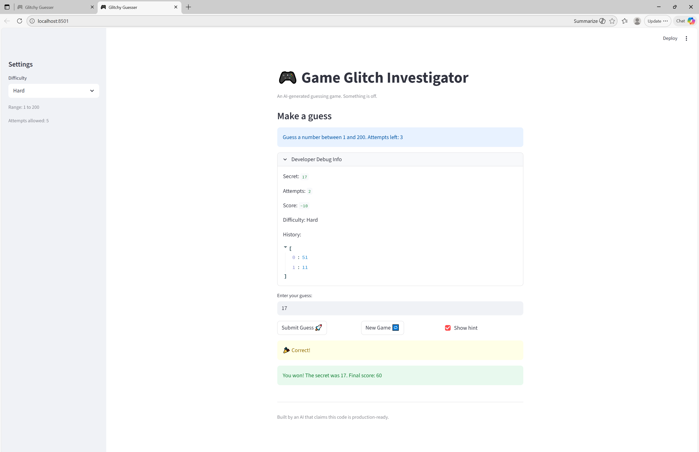

# 🎮 Game Glitch Investigator: The Impossible Guesser

## 🚨 The Situation

You asked an AI to build a simple "Number Guessing Game" using Streamlit.
It wrote the code, ran away, and now the game is unplayable. 

- You can't win.
- The hints lie to you.
- The secret number seems to have commitment issues.

## 🛠️ Setup

1. Install dependencies: `pip install -r requirements.txt`
2. Run the broken app: `python -m streamlit run app.py`

## 🕵️‍♂️ Your Mission

1. **Play the game.** Open the "Developer Debug Info" tab in the app to see the secret number. Try to win.
2. **Find the State Bug.** Why does the secret number change every time you click "Submit"? Ask ChatGPT: *"How do I keep a variable from resetting in Streamlit when I click a button?"*
3. **Fix the Logic.** The hints ("Higher/Lower") are wrong. Fix them.
4. **Refactor & Test.** - Move the logic into `logic_utils.py`.
   - Run `pytest` in your terminal.
   - Keep fixing until all tests pass!

## 📝 Document Your Experience

**Game purpose:** A number guessing game where the player tries to guess a secret number within a limited number of attempts. The difficulty setting controls the range and attempt limit. Each wrong guess costs points; winning awards points based on how few attempts were used.

**Bugs found:**
- Hard difficulty range was (1–50), easier than Normal (1–100)
- Hints were reversed — "Too High" said "Go HIGHER", "Too Low" said "Go LOWER"
- Wrong guesses on even attempt numbers awarded +5 points instead of deducting
- Win scoring had an off-by-one (`attempt_number + 1` instead of `attempt_number`)
- New Game button doesn't reset `history`, `score`, or `status`

**Fixes applied:**
- Corrected Hard range to (1–200)
- Hints now correctly say "Go LOWER" / "Go HIGHER" in `check_guess`
- Removed even-attempt +5 scoring branch; wrong guesses always deduct 5
- Fixed win scoring formula to use `attempt_number` directly
- Refactored `parse_guess`, `update_score`, `check_guess`, `get_range_for_difficulty` into `logic_utils.py`
- All 12 pytest cases pass

## 📸 Demo

## 🚀 Stretch Features

- [ ] [If you choose to complete Challenge 4, insert a screenshot of your Enhanced Game UI here]
